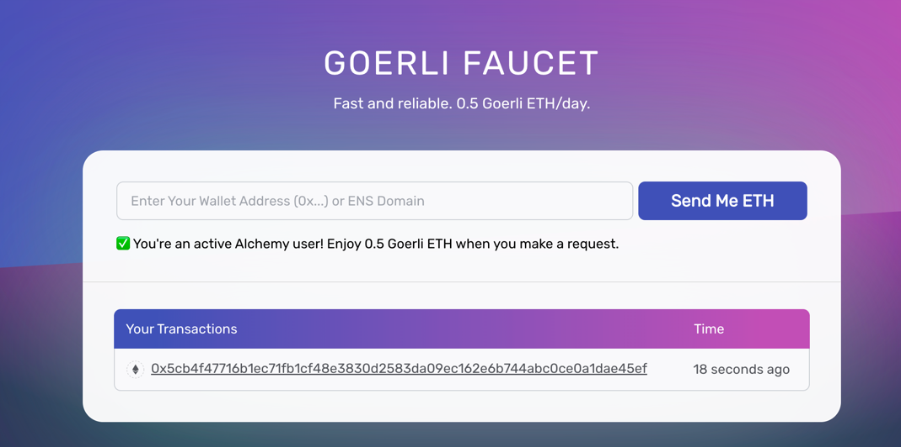
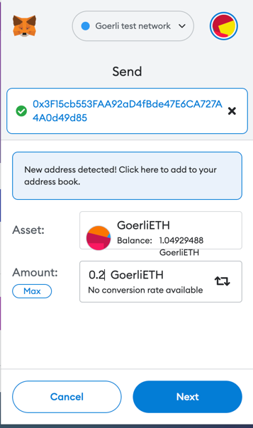
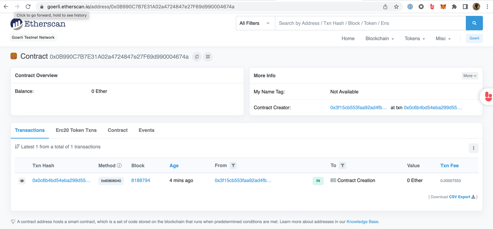
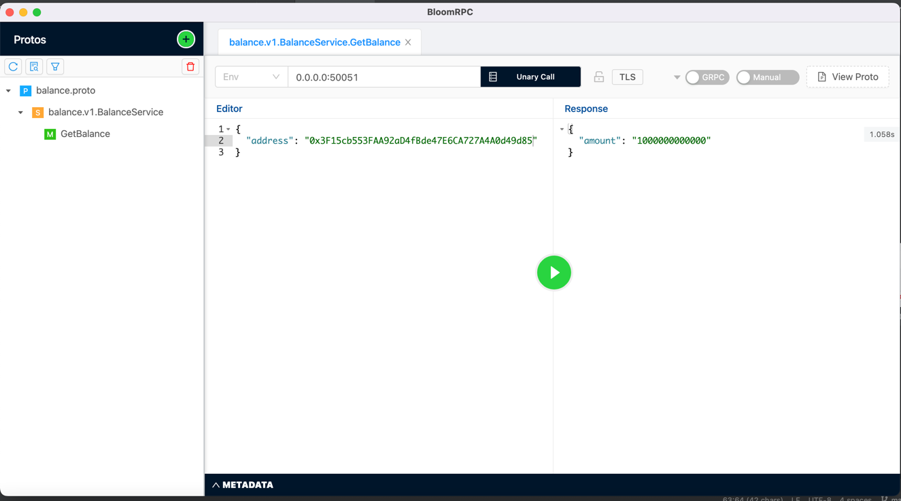
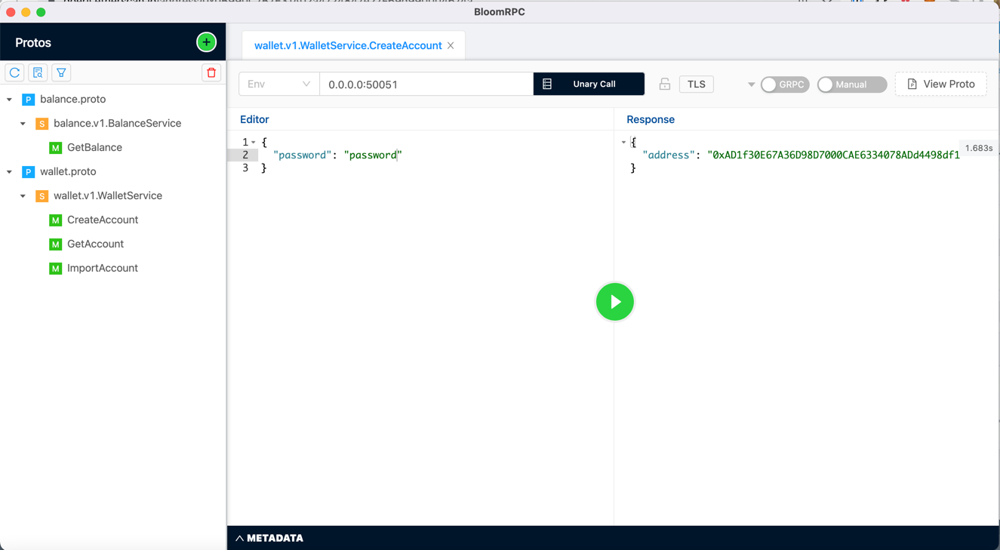
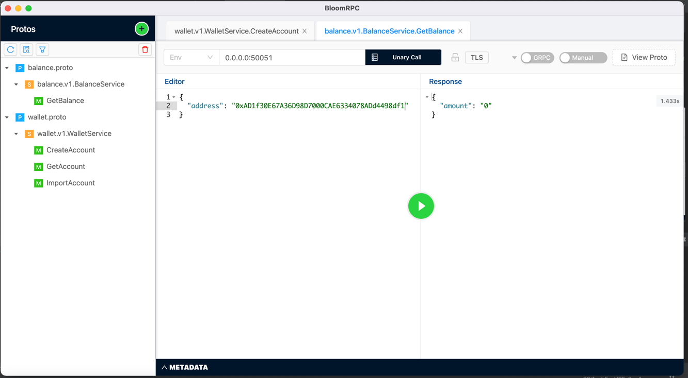
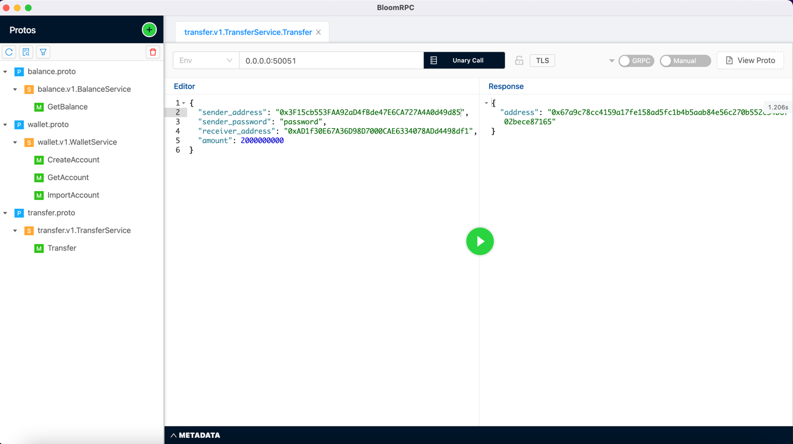
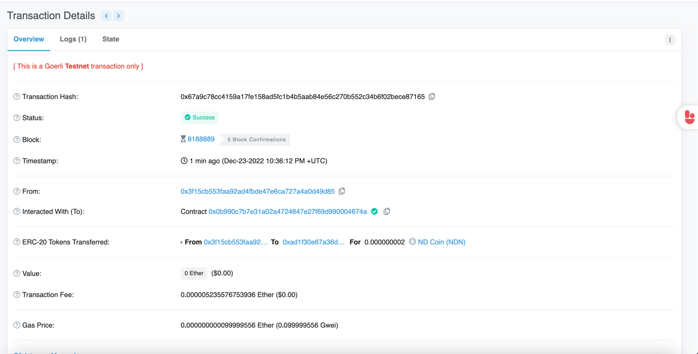
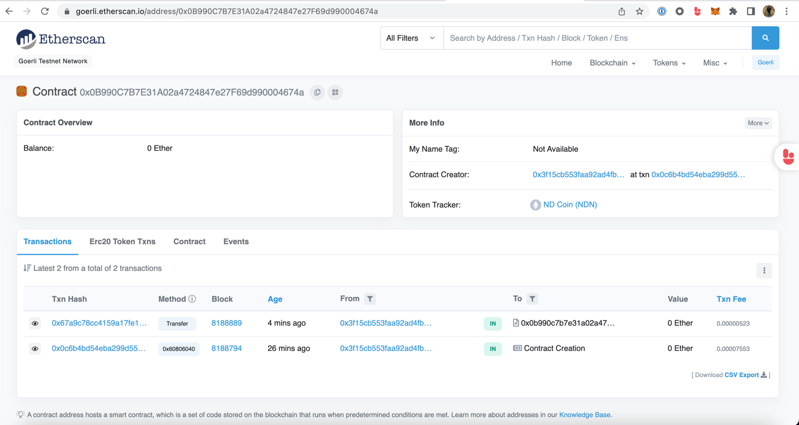
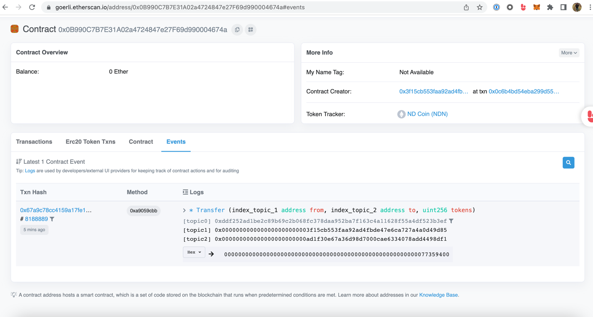

# eth-erc20
## Introduction
This is a playground for the Ethereum [ERC-20](https://ethereum.org/en/developers/docs/standards/tokens/erc-20/) standard.
There are 3 applications:
- owner-creator: it creates an account on the keystore that will be used to deploy the contract. 
- contract-deploy: it deploys the contract to Ethereum network
- erc-20: it exposes GRPC/REST endpoint to interact with the DApp

## eoa-creator
This application will create EOAs(Externally Owned Account). 
You can find more clarification on the Ethereum account [here](https://ethereum.org/en/developers/docs/accounts/#types-of-account).
We will use the owner account to deploy the contract, and it will be the owner of the DApp.
The application also generate a receiver, delegate and buyer account to test the rest of the functionallities.
The application require these env variables

```
OWNER_PASSWORD=password                                 // password for the EOA account
OWNER_BALANCE=1000000000000                             // the initial token balance of the owner
RECEIVER_PASSWORD=password                              // password for the EOA account
DELEGATE_PASSWORD=password                              // password for the EOA account
BUYER_PASSWORD=password                                 // password for the EOA account
KEY_DIR=./accounts                                      // where you want to store the accounts
```
you can use/change the script that I added. You should see something like this.
```
➜  eth-erc20 git:(master) ./scripts/owner-creator.sh
INFO[0001] owner address: 0xA58b122cea87Bb37f42FB28A9a42F60DDbcB9446  app=eoa-creator
INFO[0003] receiver address: 0x2210fb9B3dF46Bc3C57352Efee192FB2dEfD2F91  app=eoa-creator
INFO[0004] delegate address: 0x14c5063C644Efd9314E0cf7661A07D9CBA553d5a  app=eoa-creator
INFO[0005] buyer address: 0x14c5063C644Efd9314E0cf7661A07D9CBA553d5a  app=eoa-creator
```
You should see a new files inside your account directory.

## top up the owner
To interact with the contract you need to make transactions, so you need eth on the EOAs.
Let's top-up the owner because it will have the initial amount of the tokens.
faucet app



or make directly a transaction from your test account



## contract-deploy
We need to deploy the contract to the Ethereum test network, 
This application require these env variables

```
export NETWORK_URL=https://eth-goerli.g.alchemy.com/v2/{id}         // network url
export OWNER_ADDRESS=0x3F15cb553FAA92aD4fBde47E6CA727A4A0d49d85     // owner address that we have just created
export OWNER_PASSWORD=password                                      // owner password
export OWNER_BALANCE=1000000000000                                  // the amount of the tokens that you want to create
                                                                    // they will be added to the owner account
export KEY_DIR=./accounts                                           // keystorge directory
```
you can use/change the script that I added. You should see an output like this
```
➜  eth-erc20 git:(master) scripts/contract-deploy.sh
INFO[0000] owner address: 0x3F15cb553FAA92aD4fBde47E6CA727A4A0d49d85  app=contract-deploy
INFO[0001] contract deployed                             app=contract-deploy chan_id=5 contract_addr=0x0B990C7B7E31A02a4724847e27F69d990004674a owner_addr=0x3F15cb553FAA92aD4fBde47E6CA727A4A0d49d85 tr_hash=0x0c6b4bd54eba299d55c83c53473996e167980aeddf4ede38b5943332d97f4cf7 tr_price=0.000299998665
```
The contract is deployed on Ethereum test network on this address `0x0B990C7B7E31A02a4724847e27F69d990004674a`


## erc-20
It's time to interact with our contract.
Let's run the erc-20 application that need these envs
```
export NETWORK_URL=https://eth-goerli.g.alchemy.com/v2/{id}
export OWNER_ADDRESS=0x3F15cb553FAA92aD4fBde47E6CA727A4A0d49d85
export OWNER_PASSWORD=password
export OWNER_BALANCE=1000000000000
export KEY_DIR=./accounts
export CONTRACT_ADDRESS=0x0B990C7B7E31A02a4724847e27F69d990004674a
```
You can use/change the script that I added. You should see an output like this

```
➜  eth-erc20 git:(master) ✗ scripts/erc-20.sh
INFO[0000] application startedaddr[::]:50051             app=erc-20
```
The application is listening on port `50051`, it use buf-connect.
To interact with the application I use GRPC with BloomRPC, you can find the proto definitions inside the proto folder.

First thing let's get the balance of the owner (it should contain all the tokens)


Here we are, all the tokens are there.

Before to make a transfer, let's create a second account to the wallet



let's check the balance of the new account, it should 0



Perfect, let's make a transfer, remember that the accounts need to have enough eth to pay the gas.
Sender is the owner the receiver it is the account that we have just created.



Perfect the transaction is made, the address inside the result is the transaction



You can see the eth gas price and the tokens that we have transferred 0.000000002 ND Coin (NDN)
We can also check the transactions on the contract address



